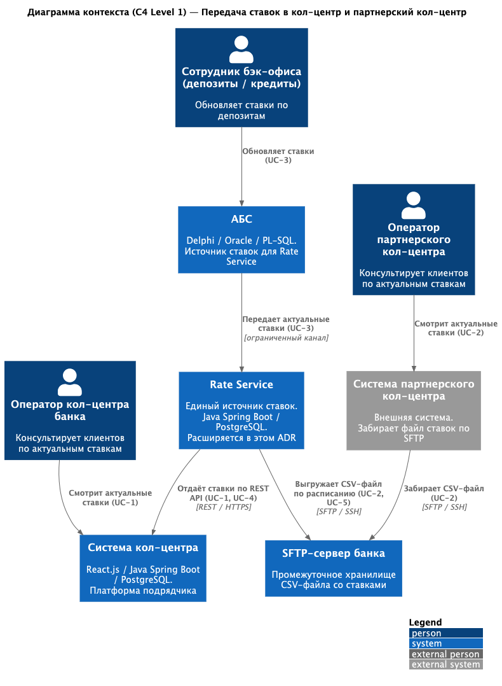
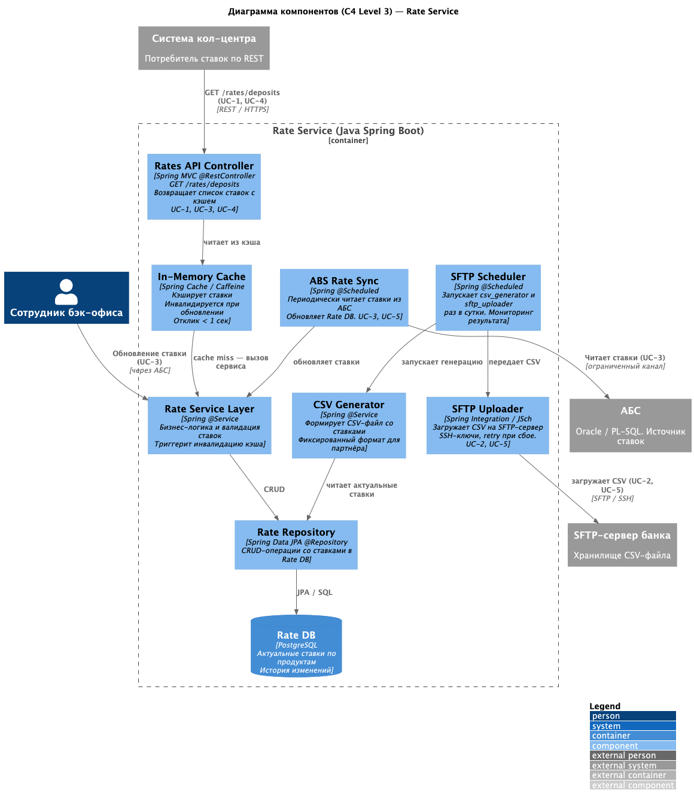

# ADR-002: Передача актуальных депозитных ставок в кол-центр и партнерский кол-центр

## Статус

Предложение

## Контекст

После запуска маркетинговой кампании по привлечению клиентов к депозитным продуктам ожидается рост обращений в кол-центр — в особенности от пожилых клиентов, которым сложно ориентироваться в онлайн-каналах. Необходимо, чтобы операторы кол-центра банка и партнерского кол-центра могли консультировать клиентов по актуальным ставкам по депозитам.

Текущая ситуация:

- Актуальные ставки хранятся только в XLS-файлах и ежедневно рассылаются по электронной почте сотрудникам бэк-офиса
- Система кол-центра (React.js + Java Spring Boot + PostgreSQL, платформа подрядчика) не имеет доступа к ставкам
- Партнерский кол-центр — внешняя система, API-интеграция с банком невозможна, партнер готов получать ставки только в виде файлов по SFTP
- Есть риск перегрузки основного кол-центра, поэтому партнерский кол-центр будет задействован параллельно
- В рамках ADR-001 уже принято решение создать Rate Service (Сервис ставок) — он является основой текущего решения

### Ключевые ограничения и требования

- Rate Service (из ADR-001) является единым источником ставок — расширяем его возможности
- Прямой доступ к БД АБС из системы кол-центра недопустим (перегрузка БД)
- Партнерский кол-центр не поддерживает API-интеграцию; данные передаются через SFTP в виде файлов
- Необходимо использовать существующий технологический стек: Java Spring Boot, PostgreSQL
- Все сервисы должны работать 24/7 с доступностью 99,9%

### **Функциональные требования**

| **№** | **Действующие лица или системы**                | **Use Case**                                                                                         | **Описание**                                                                                                                                                                                                                                                               |
| :----: | :----------------------------------------------------------------------- | :--------------------------------------------------------------------------------------------------- | :--------------------------------------------------------------------------------------------------------------------------------------------------------------------------------------------------------------------------------------------------------------------------------- |
|  UC-1  | Оператор кол-центра банка                          | Просмотр актуальных ставок по депозитам                           | Оператор открывает в системе кол-центра раздел «Ставки по депозитам» и видит актуальный список продуктов со ставками, датой последнего обновления     |
|  UC-2  | Оператор партнерского кол-центра            | Получение файла со ставками                                                  | Система партнерского кол-центра забирает файл (CSV) с актуальными ставками через SFTP-сервер банка раз в сутки; операторы видят ставки в своем интерфейсе |
|  UC-3  | Сотрудник бэк-офиса (депозиты / кредиты) | Обновление ставок по депозитам                                            | Сотрудник обновляет ставки в Rate Service (через АБС или напрямую); изменения автоматически становятся доступны кол-центрам                                                          |
|  UC-4  | Rate Service                                                             | Автоматическая публикация ставок в систему кол-центра | По событию обновления ставок или по расписанию Rate Service предоставляет актуальные данные системе кол-центра через REST API                                                            |
|  UC-5  | Rate Service                                                             | Автоматическая генерация и выгрузка файла на SFTP             | По расписанию (раз в сутки) Rate Service генерирует CSV-файл со ставками и загружает его на SFTP-сервер банка                                                                                               |

---

### **Нефункциональные требования**

| **№** | **Требование**                                                                                                                                                                                                                                                                                              |
| :----: | :-------------------------------------------------------------------------------------------------------------------------------------------------------------------------------------------------------------------------------------------------------------------------------------------------------------------- |
| NFR-1 | Cистема кол-центра и Rate Service должны работать 24/7 с доступностью 99,9%                                                                                                                                                                                                |
| NFR-2 | Cтавки в системе кол-центра должны обновляться не реже одного раза в сутки, желательна возможность принудительного обновления при изменении ставок                                       |
| NFR-3 | При сбое SFTP-выгрузки должен быть механизм повторной отправки, операторы должны видеть дату и время последнего успешного обновления ставок                                                       |
| NFR-4 | SFTP-соединение должно использовать SSH-ключи, доступ к SFTP-серверу ограничен по IP партнера, ставки не являются персональными данными, но доступ к ним должен быть ограничен |
| NFR-5 | Решение строится на существующем стеке банка (Java Spring Boot, PostgreSQL); новые технологии только при наличии внутренней экспертизы                                                                                      |
| NFR-6 | Rate Service должен поддерживать горизонтальное масштабирование с ростом нагрузки                                                                                                                                                                       |
| NFR-7 | Процесс обновления ставок и выгрузки файлов должен быть задокументирован; формат CSV-файла для партнера должен быть зафиксирован в соглашении                                                  |

---
### **Варианты**

#### Вариант 1 (не принят): Продолжить рассылку Excel по электронной почте

Сотрудники бэк-офиса продолжают рассылать XLS-файл по почте операторам обоих кол-центров.

- Плюсы: Нет изменений в IT-системах, минимальные затраты.
- Минусы: Непрактично для 200+ операторов — невозможно оперативно обновить данные у всех; высокий риск использования устаревших ставок; нет интеграции в рабочий интерфейс оператора; не масштабируется при росте кол-центра.

#### Вариант 2 (не принят): Прямой доступ системы кол-центра к БД АБС

Система кол-центра получает ставки напрямую из Oracle-базы АБС.

- Плюсы: Нет новых компонентов.
- Минусы: Команда АБС подтвердила, что БД перегружена — дополнительные запросы создают риск деградации всего банка. Прямой доступ к Oracle из системы подрядчика кол-центра создает связанность и нарушает периметр безопасности. АБС масштабируется только вертикально.

#### Вариант 3 (принят): Расширение Rate Service + SFTP-выгрузка

Rate Service из ADR-001 расширяется REST API для кол-центра и планировщиком SFTP-выгрузки для партнера.

- Плюсы: Единый источник ставок, автоматизация, нет нагрузки на АБС, покрывает оба кол-центра, использует существующий Java-стек, минимальное количество новых компонентов.
- Минусы: Требует разработки SFTP-инфраструктуры, изменения в UI системы кол-центра зависят от подрядчика.

**Недостатки, ограничения, риски**

- Система кол-центра поддерживается внешним подрядчиком — изменения UI требуют согласования и могут задержать реализацию. Митигация: привлечь Java-специалистов из команды АБС для разработки интеграции.
- Ставки обновляются вручную сотрудниками бэк-офиса — остается человеческий фактор и риск использования устаревших данных. Автоматизация расчета ставок выходит за рамки данного ADR.
- SFTP-файл для партнера генерируется раз в сутки: оперативность ограничена. При необходимости частоту генерации можно увеличить.
- АБС масштабируется только вертикально — данное решение не добавляет нагрузки на АБС, что является его преимуществом.
- Зависимость от доступности SFTP-сервера: необходим мониторинг и алертинг.

### **Решение**

#### Архитектурное решение

Принятое решение опирается на Rate Service, созданный в рамках ADR-001. Расширяем его двумя новыми возможностями:

1. Интеграция с системой кол-центра банка — Rate Service предоставляет REST API, система кол-центра периодически (polling) или по push-уведомлению получает актуальные ставки и отображает их операторам. Работы по интеграции UI выполняются командой подрядчика кол-центра, либо Java-специалистами из команды АБС (у них есть экспертиза в Java Spring Boot).
2. SFTP-выгрузка для партнерского кол-центра — в Rate Service добавляется планировщик (Scheduler), который раз в сутки генерирует CSV-файл со ставками и выгружает его на SFTP-сервер банка. Партнерский кол-центр самостоятельно забирает файл по расписанию.

Логика принятых решений:

- Прямой доступ к БД АБС из системы кол-центра исключен — АБС и без того перегружена
- Rate Service как единый источник ставок (из ADR-001) расширяется без создания новых компонентов
- Для партнера выбран SFTP, поскольку это единственный доступный механизм интеграции
- Polling/push для кол-центра предпочтительнее новой интеграционной шины, так как ставки меняются не чаще раза в сутки

#### Диаграммы C4

#### Список крупных задач по системам

**Rate Service (расширение существующего)**

- Добавить REST API-эндпоинт для системы кол-центра (`GET /rates/deposits`)
- Добавить Scheduler для генерации CSV-файла со ставками (раз в сутки)
- Реализовать выгрузку CSV-файла на SFTP-сервер банка
- Реализовать механизм повторной отправки при сбое SFTP
- Документировать API и формат CSV-файла

**Система кол-центра (подрядчик / Java-специалисты АБС)**

- Добавить экран «Ставки по депозитам» в UI оператора
- Реализовать интеграцию с Rate Service по REST API (polling раз в N минут или webhook)
- Отображать дату и время последнего обновления ставок

**SFTP-инфраструктура банка (IT-отдел)**

- Развернуть SFTP-сервер в инфраструктуре банка
- Настроить аутентификацию по SSH-ключам
- Ограничить доступ по IP партнера
- Настроить мониторинг доступности SFTP-сервера

**Партнерский кол-центр (внешняя сторона)**

- Настроить автоматическое скачивание CSV-файла по SFTP по расписанию
- Реализовать отображение ставок в интерфейсе операторов партнера

---

### **Таблица задач RoadMap**

| **ID** | **Система**                       | **Задача**                                                                                 | **Горизонт** |
| :----: | :--------------------------------------- | :----------------------------------------------------------------------------------------------- | :------------------: |
|   T1   | Rate Service                             | Расширить REST API (GET /rates/deposits)                                                |       Q2 2026       |
|   T2   | Rate Service                             | Добавить Scheduler генерации CSV-файла                                     |       Q2 2026       |
|   T3   | Rate Service                             | Реализовать выгрузку CSV на SFTP-сервер                               |       Q3 2026       |
|   T4   | Rate Service                             | Механизм повторной отправки при сбое SFTP                        |       Q3 2026       |
|   T5   | Rate Service                             | Тестирование и документация                                             |    Q4 2026 (MVP)    |
|   T6   | Rate Service                             | Увеличение частоты обновлений (несколько раз в день) |     Q1–Q2 2027     |
|   T7   | Rate Service                             | Мониторинг и алертинг Rate Service + SFTP                                     |     Q1–Q2 2027     |
|   T8   | Система кол-центра       | Согласование изменений с подрядчиком кол-центра        |       Q2 2026       |
|   T9   | Система кол-центра       | Разработка интеграции с Rate Service (polling)                              |       Q3 2026       |
|  T10  | Система кол-центра       | Добавить экран «Ставки по депозитам» в UI оператора    |    Q4 2026 (MVP)    |
|  T11  | Система кол-центра       | Обучение операторов работе с новым разделом                |     Q1–Q2 2027     |
|  T12  | SFTP-инфраструктура        | Развернуть SFTP-сервер в инфраструктуре банка                |       Q2 2026       |
|  T13  | SFTP-инфраструктура        | Настроить SSH-ключи и ограничения доступа по IP               |       Q3 2026       |
|  T14  | SFTP-инфраструктура        | Настроить мониторинг SFTP-сервера                                      |    Q4 2026 (MVP)    |
|  T15  | АБС                                   | Добавить UI для ввода ставок в АБС (вместо XLS)                  |       Q2 2026       |
|  T16  | АБС                                   | API-эндпоинт / триггер для публикации ставок в Rate Service   |       Q3 2026       |
|  T17  | АБС                                   | Автоматизация расчета ставок (убираем Excel полностью) |     Q1–Q2 2027     |
|  T18  | Партнерский кол-центр | Согласовать формат CSV-файла с партнером                         |       Q2 2026       |
|  T19  | Партнерский кол-центр | Настроить SFTP-клиент и расписание скачивания                |       Q3 2026       |
|  T20  | Партнерский кол-центр | Отображение ставок в UI операторов партнера                  |    Q4 2026 (MVP)    |
|  T21  | Партнерский кол-центр | Обучение операторов партнера                                           |     Q1–Q2 2027     |

[Роадмэп в графическом виде](RoadMap.drawio)
---
