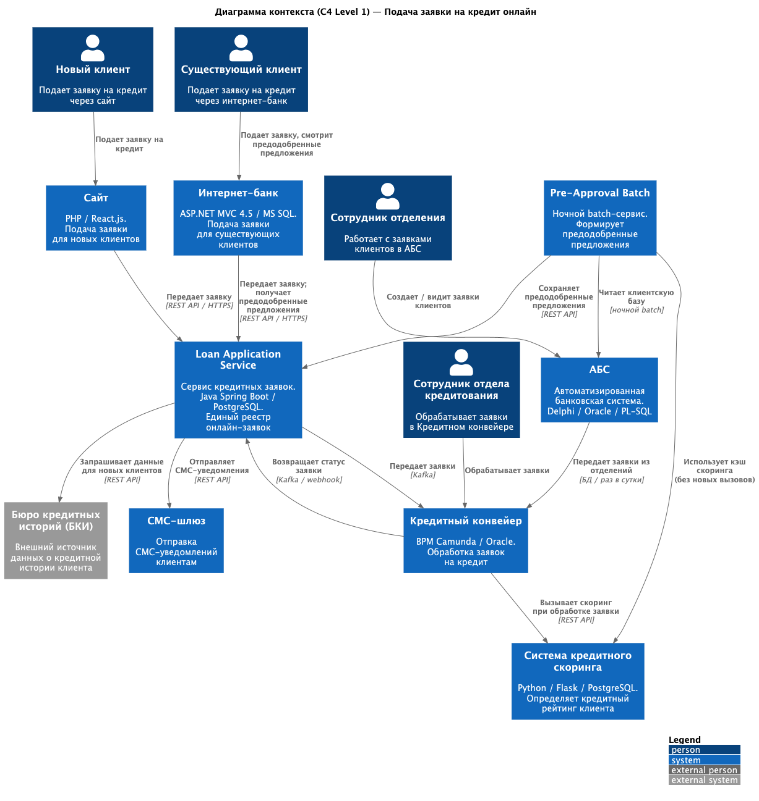
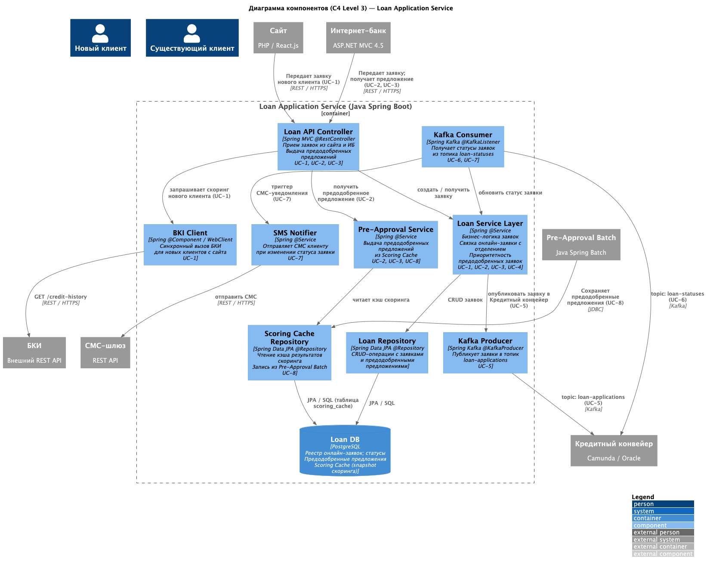

# ADR-003: Подача заявки на кредит онлайн — интернет-банк и сайт

## Статус

Предложение

## Контекст

Банк «Стандарт» реализует следующий этап цифровой трансформации — онлайн-подачу заявки на кредит через интернет-банк и сайт. Кредитный процесс должен быть реализован в течение года после запуска MVP депозитного направления (ADR-001).

Текущая ситуация:

- Клиент может подать заявку на кредит только в отделении через АБС
- Заявки из АБС раз в сутки передаются в Кредитный конвейер (Camunda / Oracle)
- Решение по заявке принимается сотрудником отдела кредитования в Кредитном конвейере
- Система кредитного скоринга (Python / Flask / PostgreSQL) вызывается через API в момент обработки заявки; источники — АБС и Бюро кредитных историй (БКИ)
- Предодобренные предложения не реализованы; клиент не видит персональных условий до визита в отделение
- Ускорить обмен между АБС и Кредитным конвейером (сейчас раз в сутки через БД) невозможно

### Ключевые ограничения и требования

- Интеграция АБС → Кредитный конвейер работает раз в сутки через БД — менять нельзя
- Кредитный конвейер и система скоринга поддерживают горизонтальное масштабирование и работу 24/7
- Система кредитного скоринга испытывает повышенную нагрузку в рабочие часы — дополнительные предрасчеты нагружать ее нельзя
- Интернет-банк — монолит ASP.NET MVC 4.5 / .NET Framework 4.5 / MS SQL; ядро изменять нежелательно
- На сайте новый клиент не идентифицирован — доступны только данные БКИ
- Заявка, поданная на сайте, должна быть связана с заявкой в отделении (если клиент придет позже)
- Предодобренные предложения должны формироваться без дополнительной нагрузки на систему скоринга
- Заявки по предодобренным предложениям должны обрабатываться сотрудниками в течение того же рабочего дня
- Данные клиентов при передаче должны быть защищены шифрованием (HTTPS/TLS)
- Все сервисы должны работать 24/7 с доступностью 99,9%

### **Функциональные требования**

| **№** | **Действующие лица или системы**         | **Use Case**                                                                               | **Описание**                                                                                                                                                                                                                                                                                                                                                   |
| :----: | :---------------------------------------------------------------- | :----------------------------------------------------------------------------------------- |:---------------------------------------------------------------------------------------------------------------------------------------------------------------------------------------------------------------------------------------------------------------------------------------------------------------------------------------------------------------|
|  UC-1  | Новый клиент (сайт)                                | Подача заявки на кредит с сайта                                  | Клиент видит предложение по кредиту со ставкой, заполняет ФИО и телефон. Если дополнительно вводит паспортные данные — система передает их в систему скоринга, которая запрашивает БКИ и возвращает предварительное решение (одобрено / не одобрено). После подачи заявки клиент получает СМС с приглашением в отделение для идентификации и получения кредита |
|  UC-2  | Существующий клиент (интернет-банк) | Просмотр предодобренного предложения по кредиту | Клиент заходит в интернет-банк и видит персональное предодобренное предложение (сумма, ставка), рассчитанное на основе ранее выполненного скоринга                                                                                                                                                                                                             |
|  UC-3  | Существующий клиент (интернет-банк) | Подача заявки на кредит через интернет-банк           | Клиент выбирает счет зачисления и заполняет параметры заявки, подтверждает отправку СМС-кодом. Если есть предодобренное предложение — заявка обрабатывается по упрощенной процедуре и должна быть рассмотрена в течение того же рабочего дня                                                                                                                   |
|  UC-4  | Сотрудник отделения                             | Работа с заявкой клиента в отделении                        | Сотрудник в АБС видит существующую заявку (поданную онлайн или на сайте) и продолжает работу с ней. Для нового клиента создает новую заявку                                                                                                                                                                                                                    |
|  UC-5  | Кредитный конвейер                               | Получение заявки на кредит                                          | Заявки из интернет-банка и сайта поступают в Кредитный конвейер минуя суточную задержку АБС — через новый сервис кредитных заявок по Kafka. Заявки из отделений поступают по старому каналу (через АБС раз в сутки)                                                                                                                                            |
|  UC-6  | Сотрудник отдела кредитования          | Обработка заявки в Кредитном конвейере                   | Сотрудник видит заявки из всех каналов (онлайн и отделение), обрабатывает их. Заявки по предодобренным предложениям помечены приоритетом — обрабатываются в течение того же дня                                                                                                                                                                                |
|  UC-7  | Клиент                                                      | Получение СМС об изменении статуса заявки              | После изменения статуса заявки (получена / одобрена / отклонена) клиент автоматически получает СМС-уведомление                                                                                                                                                                                                                                                 |
|  UC-8  | Система                                                    | Формирование предодобренных предложений               | Ночной фоновый процесс (batch) обходит клиентскую базу АБС и для части клиентов рассчитывает предодобренное предложение на основе кэшированных данных скоринга — без новых запросов к системе скоринга в рабочее время                                                                                                                                         |

---

### **Нефункциональные требования**

| **№** | **Требование**                                                                                                                                                                                                                                                                                                                                          |
| :----: | :---------------------------------------------------------------------------------------------------------------------------------------------------------------------------------------------------------------------------------------------------------------------------------------------------------------------------------------------------------------- |
| NFR-1 | Интернет-банк, сайт и новые сервисы должны работать 24/7 с доступностью 99,9%; резервный ЦОД должен обеспечивать переключение при сбое основного                                                                                |
| NFR-2 | Отклик по всем операциям — миллисекунды; справочные данные (список кредитных продуктов, предодобренные предложения) должны загружаться менее чем за 1 секунду — кэшировать на уровне приложения |
| NFR-3 | Все данные клиента при передаче защищены HTTPS/TLS; паспортные данные — персональные, требуют особой защиты; СМС-подтверждение реализуется командой банка без доработки ядра подрядчика                      |
| NFR-4 | Сервис кредитных заявок, Кредитный конвейер и система скоринга поддерживают горизонтальное масштабирование; АБС масштабируется только вертикально — ее нагрузку не увеличивать                           |
| NFR-5 | Система кредитного скоринга не должна получать дополнительную нагрузку в рабочие часы; предодобренные предложения рассчитываются ночным batch-процессом на основе кэшированных данных                  |
| NFR-6 | Предпочтительно использовать существующий стек банка (Java Spring Boot, PostgreSQL, Kafka, Python/Flask), новые технологии — только при наличии внутренней экспертизы                                                                                         |
| NFR-7 | Заявка, поданная на сайте, должна быть однозначно связана с заявкой в Кредитном конвейере; при повторном обращении клиента в отделение сотрудник должен видеть уже созданную заявку                       |
| NFR-8 | Все новые сервисы должны иметь документацию API для дальнейшего расширения; формат интеграционных сообщений в Kafka должен быть зафиксирован                                                                                                    |

---

### **Варианты**

#### Вариант 1 (не принят): Передавать онлайн-заявки напрямую в АБС → Кредитный конвейер через существующий канал БД

Онлайн-заявки записываются в БД АБС; Кредитный конвейер забирает их раз в сутки по стандартному каналу.

- **Плюсы:** Нет новых компонентов.
- **Минусы:** Заявки по предодобренным предложениям должны обрабатываться в течение дня — суточная задержка делает это невозможным. БД АБС перегружена — прямая запись онлайн-заявок усугубляет ситуацию.

#### Вариант 2 (не принят): Прямая интеграция интернет-банка и сайта с Кредитным конвейером по REST API

Интернет-банк и сайт напрямую вызывают REST API Кредитного конвейера.

- **Плюсы:** Нет промежуточных сервисов, заявки попадают сразу.
- **Минусы:** Кредитный конвейер — коробочное BPM-решение (Camunda), не предназначенное для прямых онлайн-вызовов из клиентских приложений. Создается жесткая связанность. Нет возможности буферизации при пиковой нагрузке. Отсутствует единое место хранения онлайн-заявок для связки с визитом в отделение.

#### Вариант 3 (принят): Новый Сервис кредитных заявок + Kafka + ночной batch для предодобренных предложений

Вводится новый **Сервис кредитных заявок** (Loan Application Service), который принимает заявки из всех онлайн-каналов, хранит их и передает в Кредитный конвейер через Kafka асинхронно. Предодобренные предложения рассчитываются ночным batch-процессом без нагрузки на скоринг в рабочее время.

- **Плюсы:** Развязка каналов, отсутствие нагрузки на АБС и скоринг, поддержка предодобренных предложений, единое хранилище онлайн-заявок, масштабируемость.
- **Минусы:** Новый компонент требует разработки; необходима экспертиза в Kafka (уже принята в рамках ADR-001).

---

### **Решение**

#### Архитектурное решение

Принятое решение опирается на инфраструктуру, созданную в ADR-001 (Kafka, Deposit Application Service как образец), и расширяет ее для кредитного направления:

1. Сервис кредитных заявок (Loan Application Service, Java Spring Boot / PostgreSQL):

   - Принимает заявки из интернет-банка и сайта по REST API
   - Хранит заявки в собственной БД PostgreSQL (единый реестр онлайн-заявок)
   - Передает заявки в Кредитный конвейер через Kafka асинхронно — минуя суточный цикл АБС
   - Отправляет СМС-уведомления об изменении статуса через СМС-шлюз
   - Связывает онлайн-заявку с заявкой в отделении по идентификатору клиента

2. Batch-сервис предодобренных предложений (Pre-Approval Batch, Java / Spring Batch):

   - Запускается ночью (вне рабочих часов)
   - Обходит клиентскую базу АБС (через уже существующий интеграционный канал)
   - Использует кэшированные результаты скоринга — без новых вызовов системы скоринга
   - Сохраняет предодобренные предложения в БД Loan Application Service
   - Интернет-банк получает предодобренные предложения через REST API Loan Application Service

3. Интеграция с Кредитным конвейером:

   - Consumer в Кредитном конвейере читает заявки из Kafka и создает задачи в Camunda
   - Заявки по предодобренным предложениям помечаются флагом приоритета
   - Обратный статус заявки передается в Loan Application Service (через Kafka или webhook)

4. Интеграция с сайтом — скоринг нового клиента:

   Для нового клиента, указавшего паспортные данные на сайте, предварительный скоринг выполняется через **существующую систему скоринга** (Python / Flask) — тот же компонент, что используется Кредитным конвейером. Loan Application Service передает паспортные данные в систему скоринга по REST API; система скоринга самостоятельно запрашивает БКИ и возвращает предварительное решение.

   Это решение обосновано следующим:
   - Система скоринга уже имеет интеграцию с БКИ — дублировать ее в Loan Application Service нецелесообразно
   - Единая точка скоринга исключает расхождение логики оценки в разных каналах
   - Для нового клиента единственный внешний источник данных — БКИ; данных АБС нет, поэтому нагрузка на АБС не увеличивается
   - Ограничение NFR-5 (не нагружать скоринг в рабочие часы массовыми предрасчетами) касается batch-процессов, а не единичных синхронных запросов от реальных клиентов

Логика принятых решений:

- Kafka уже принята как стандарт в банке (ADR-001) — используем для кредитного направления
- Ночной batch исключает нагрузку на систему скоринга в рабочее время
- Loan Application Service — единый реестр онлайн-заявок — решает задачу связки с отделением
- Скоринг нового клиента с сайта выполняется через существующую систему скоринга, а не напрямую через БКИ — чтобы не дублировать интеграцию и не создавать расхождения в логике оценки

### Диаграммы C4

---

### **Недостатки, ограничения, риски**

- Асинхронность Kafka вносит небольшую задержку между подачей заявки и ее появлением в Кредитном конвейере — для предодобренных заявок это допустимо (цель — день), но требует мониторинга лага очереди.
- Ночной batch зависит от доступности АБС и объема клиентской базы — при росте клиентов нужно контролировать время выполнения, чтобы batch завершался до начала рабочего дня.
- Идентификация нового клиента с сайта: клиент получает предварительное решение, но все равно обязан явиться в отделение для верификации — это ограничение регуляторных требований банка, не техническое.
- Кредитный конвейер частично поддерживается внешним подрядчиком — разработка Kafka Consumer потребует координации с ним или использования внутренних Java-специалистов.
- АБС не масштабируется горизонтально — batch-процесс должен работать в ночное время с ограниченной частотой запросов, чтобы не перегрузить Oracle.
- Система скоринга не вызывается в batch — предодобренные предложения основаны на кэше. Если с момента последнего скоринга ситуация клиента изменилась, предложение может быть неактуальным. При подаче заявки скоринг запускается повторно.
- Синхронный вызов системы скоринга для нового клиента с сайта увеличивает время ответа пользователю на величину latency скоринга + БКИ. Это приемлемо для сценария с паспортными данными (клиент осознанно ждет предварительного решения), но требует таймаута и graceful degradation на случай недоступности скоринга или БКИ.
